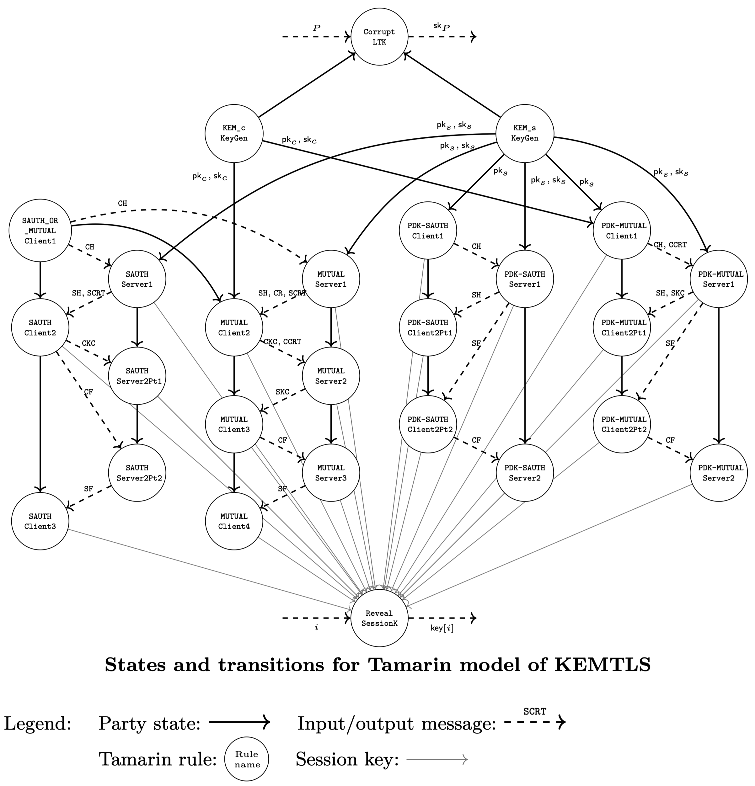

# Tamarin model for Core KEMTLS ("CoreKT")

This repository contains a Tamarin model for the "core cryptographic version" of the KEMTLS and KEMTLS-PDK protocol.  Roughly speaking, this means the version of KEMTLS as specified in Figures 3 and 7 of https://eprint.iacr.org/2020/534.pdf, and the version of KEMTLS-PDK as specified in https://eprint.iacr.org/2021/779.pdf, without any additional the framing from the TLS protocol, such as extra TLS message fields, pre-shared key / resumption, or handshake / application layer encryption.

The goal of this modelling exercise is to very closely follow the pen-and-paper security model and properties as specified in the multi-stage key exchange security model of the KEMTLS papers (https://eprint.iacr.org/2020/534.pdf and https://eprint.iacr.org/2021/779.pdf).

## Organization of the code base

The code base uses the M4 macro language to combine multiple source files into Tamarin files, as well as using macros to generate code and select different segments of code (M4 ifdef's).  The code base also uses Tamarin #ifdef's to selectively run different segments of code.

### General

- `Makefile` is available for running various proofs; see the [Running the model](#running-the-model) section below.

- `run_proofs.py` is an alternative Python3 script for running various proofs that provides better summary output for long jobs.

- `GLOSSARY.md` summarizes the primitives, state facts, and action facts used throughout the protocol, model, and lemmas.

- `corekt.spthy` uses m4 macros to pull all the above Tamarin source code (except deniability) into a single file.  Follow the instructions below to run the command `make preprocess` to generate the resulting file `generated_corekt.spthy`, which is the file you should actually have Tamarin run.

- The `output` folder contains output from having run the model.

### Protocol and adversary rules

- The `protocol` folder contains the formulation of the KEMTLS protocol in Tamarin.  In fact it includes four KEMTLS protocol modes: server-only authentication and mutual authentication from the original paper (https://eprint.iacr.org/2020/534.pdf), and server-only authentication and mutual authentication when server public keys are predistributed ("PDK mode") (https://eprint.iacr.org/2021/779.pdf).  Each variant has several files for the client side, server side, and shared code. The following diagram shows the logical flow of the rules for the four variants:

	

- The `model` folder contains oracles that are accessible to the adversary for compromising secret keys (CorruptLTK and RevealSessionKey).

### Lemmas

- The `lemmas` folder contains lemmas modelling correctness and security properties.

	- `lemmas/reachable.spthy` contains lemmas that model correctness of the protocol. In particular, we want to check that it is possible to generate sessions and stages that achieve each of the intended states. This includes the expected levels of forward secrecy and authentication for every stage. M4 macros are used to generate lemmas for all the stages of all the variants.
	- `lemmas/attacker_works.spthy` contains a few basic lemmas that check that it's possible for the attacker to trigger its various corruption queries to actual learn all stage keys (when its reveal powers are unrestricted). M4 macros are used to generate lemmas for all the stages of all the variants.
	- `lemmas/match_security.spthy` contains lemmas that model "match security". This means the sound behaviour of session matching: that, for honest sessions, the session identifier matches the partnered session. This is a codification of Section B.4 and Definition B.1 of https://eprint.iacr.org/2020/534.pdf. Please see Section B.4 of the paper for references on the origin of modelling match security as a separate property for authenticated key exchange protocols.
	- `lemmas/sk_security.spthy` contains lemmas that model session key security. There are separate lemmas checking keys that are intended to have "no forward secrecy", "weak forward secrecy 1", "weak forward secrecy 2", or "(full) forward secrecy".  This is a codification of the freshness conditions in Definition B.3 of https://eprint.iacr.org/2020/534.pdf and Definition B.5.2 of https://eprint.iacr.org/2021/779.pdf. Note that there are just four lemmas total in this file—one for each level of forward secrecy, rather than one for each stage—since the lemmas make use of the expected level of forward secrecy recorded for each stage in the protocol description in `protocol`.
	- `lemmas/malicious_acceptance.spthy` contains a lemma that models authentication security of KEMTLS: for session stages that believe they have authenticated their peer, there really is a matching session. This is a codification of Definition B.5.3 in https://eprint.iacr.org/2021/779.pdf.

### Deniability

- The `deniability` folder contains protocol specifications and lemmas for modelling offline deniability of KEMTLS via Tamarin's observational equivalence feature.  For each `variant` in {`sauth`, `mutual`, `pdk_sauth`, `pdk_mutual`}:

	- `deniability/variant_real.spthy` contains a rule that generates the transcript using parties' secret keys to decapsulate.
	- `deniability/variant_simulated.spthy` contains a rule that generates the transcript using only parties' public keys.
	- `deniability/variant.spthy` contains a lemma checking that the transcripts generated by the `real` and `simulated` rules are indistinguishable.

## Running the model

### Getting started

1. You'll need to have a working version of [Tamarin prover](https://tamarin-prover.github.io) installed.  The lemmas have been tested with Tamarin version 1.6.1.
2. Run `make preprocess` to run the M4 preprocessor to generate various combined Tamarin files.

### To run all lemmas except deniability

The following commands can be used to run all the lemmas on the command-line using the Makefile.  The output will be shown on the screen and stored in the `output` directory.  You can prove a specific lemma by adding `PROVE=lemma_name`  (e.g., `PROVE=sk_security_wfs1`) to the end of the command.  See the [Sample runtimes](#sample-runtimes) section below for an estimate on how long these commands may take.

```bash
# To run with a single variant enabled:
time make prove-sauth
time make prove-mutual
time make prove-pdk-sauth
time make prove-pdk-sauth

# To run with two variants enabled:
time make prove-sauth-mutual
time make prove-pdk-sauth-mutual

# To run with all four variants enabled:
time make prove-all
```

You can also use `run_proofs.py` to get better summary output; the generated proofs will be stored in the `proofs` directory.

```bash
# To run with a single variant enabled:
make preprocess
python3 run_proofs.py generated_corekt.spthy -DINCLUDE_KEMTLS_SAUTH_OR_MUTUAL -DINCLUDE_KEMTLS_SAUTH
python3 run_proofs.py generated_corekt.spthy -DINCLUDE_KEMTLS_SAUTH_OR_MUTUAL -DINCLUDE_KEMTLS_MUTUAL
python3 run_proofs.py generated_corekt.spthy -DINCLUDE_KEMTLS_PDK_SAUTH
python3 run_proofs.py generated_corekt.spthy -DINCLUDE_KEMTLS_PDK_MUTUAL

# To run with two variants enabled:
make preprocess
python3 run_proofs.py generated_corekt.spthy -DINCLUDE_KEMTLS_SAUTH_OR_MUTUAL -DINCLUDE_KEMTLS_SAUTH -DINCLUDE_KEMTLS_MUTUAL
python3 run_proofs.py generated_corekt.spthy -DINCLUDE_KEMTLS_PDK_SAUTH -DINCLUDE_KEMTLS_PDK_MUTUAL

# To run with all four variants enabled:
make preprocess
python3 run_proofs.py generated_corekt.spthy -DINCLUDE_KEMTLS_SAUTH_OR_MUTUAL -DINCLUDE_KEMTLS_SAUTH -DINCLUDE_KEMTLS_MUTUAL -DINCLUDE_KEMTLS_PDK_SAUTH -DINCLUDE_KEMTLS_PDK_SAUTH -DINCLUDE_KEMTLS_PDK_MUTUAL
```

To use the Tamarin web UI, you'll need to use `-D` defines to include the different variants, similar to the code above. For example:

```bash
make preprocess
tamarin-prover interactive -DINCLUDE_KEMTLS_SAUTH_OR_MUTUAL -DINCLUDE_KEMTLS_SAUTH .
```

### To run deniability lemmas

```bash
# offline deniability of abbreviated handshake
time make deniability-sauth
time make deniability-mutual
time make deniability-pdk-sauth
time make deniability-pdk-mutual
# or
time make deniability-all

# offline deniability of full handshake (VERY SLOW!)
time make deniability-sauth-full
time make deniability-mutual-full
time make deniability-pdk-sauth-full
time make deniability-pdk-mutual-full
# or
time make deniability-full-all
```

Without `-full`, some messages are omitted, and these take between 1 minute and 30 minutes each to run on a 16-core machine with 100+ GB of RAM; see the [Sample runtimes](#sample-runtimes) section below.

With `-full`, all messages are included, and the execution time can become prohibitively expensive.  For example, the `sauth` variant without `-full` takes about 1 minute; the `sauth` variant **with** `-full` takes about 16 hours.  We were not able to successfully run other full variants to completion.

See the documentation in `deniability/kemtls_variant.spthy` for a more detailed explanation of the security property and what is included/excluded in the abbreviated version.

## Sample runtimes

The table below shows runtimes on a server with two 20-core Intel Xeon Gold 6230 CPUs, which after hyperthreading gives us 80 threads. The server has 192 GB of RAM.

Communication bottlenecks between cores prevent fully utilising all resources. Sometimes providing Tamarin with too many resources slows things down. We typically restricted Tamarin to use only 16 cores by setting `env TAMARIN_FLAGS="+RTS -N16 -RTS" time make ...`

| **Lemma**                 | **KEMTLS-sauth** | **KEMTLS-mutual** | **KEMTLS (both)** | **KEMTLS-PDK-sauth** | **KEMTLS-PDK-mutual** | **KEMTLS-PDK (both)** | All 4 KEMTLS variants |
| :------------------------ | :--------------: | :---------------: | :---------------: | :------------------: | :-------------------: | :-------------------: | :-------------------: |
| reachable\_\*             | 0:01:17          | 0:01:20           | 0:04:32           | 0:01:46              | 0:01:36               | 0:04:40               | 0:13:25               |
| attacker\_works\_\*       | 0:00:17          | 0:00:46           | 0:01:16           | 0:00:17              | 0:00:23               | 0:00:53               | 0:12:04               |
| match\_\*                 | 0:01:02          | 0:01:22           | 0:02:55           | 0:00:55              | 0:01:14               | 0:02:46               | 0:09:53               |
| sk\_sec\_nofs\_client     | 0:00:05          | 0:00:07           | 0:00:16           | 0:00:05              | 0:00:05               | 0:00:14               | 0:00:41               |
| sk\_sec\_nofs\_server     | 0:00:05          | 0:00:06           | 0:00:12           | 0:00:05              | 0:00:06               | 0:00:14               | 0:00:40               |
| sk\_sec\_wfs1             | 0:00:21          | 0:00:10           | 0:01:05           | 0:00:17              | 0:00:18               | 0:00:41               | 0:03:00               |
| sk\_sec\_wfs2             | 0:00:36          | 0:00:28           | 0:01:30           | 0:00:28              | 0:00:22               | 0:01:23               | 0:24:28               |
| sk\_sec\_fs               | 0:01:20          | 0:03:05           | 0:06:38           | 0:01:21              | 0:01:33               | 0:05:07               | 1:39:58               |
| malicious\_acceptance     | 0:00:13          | 0:01:40           | 0:04:13           | 0:00:17              | 0:00:22               | 0:01:39               | 27:29:37              |
| deniability (abbreviated) | 0:01:02          | 0:12:15           | —                 | 0:00:24              | 0:29:10               | —                     | —                     |
| **Total (excl. den.)**    | **0:05:16**      | **0:09:05**       | **0:22:38**       | **0:05:30**          | **0:06:00**           | **0:17:38**           | **30:13:46**          |

## Limitations

- The model generally does not include non-cryptographic details of the handshake, such as TLS handshake messages, extensions, or the record layer.

- The model does not include handshake encryption or algorithm negotiation.

- The model does not include TLS's pre-shared key (PSK) mode.

- The model uses three distinct KEMs for ephemeral key exchange, server authentication and client authentication. This implicitly assumes the same certificate is not used for both purposes, which was the basis of the Selfie attack. Without this limitation, we observe a state-space explosion with a major impact on performance. For example, if KEM\_c = KEM\_s, the first 10 out of 11 `reachable_*` lemmas take over 8 hours, and the last `reachable_*` lemma did not terminate after 45 hours, compared to all 11 `reachable_*` lemmas taking just over 1 minute with distinct KEM\_c and KEM\_s.

- The deniability lemmas are for abbreviated transcripts (without messages generated deterministically from earlier parts of transcript) and omit ephemeral coins. Without this limitation, there is a major impact on performance. For example, including full transcripts for KEMTLS-sauth increases run-time from 1 minute to 16 hours, whereas including ephemeral coins increases runtime from 1 minute to 110 minutes.
